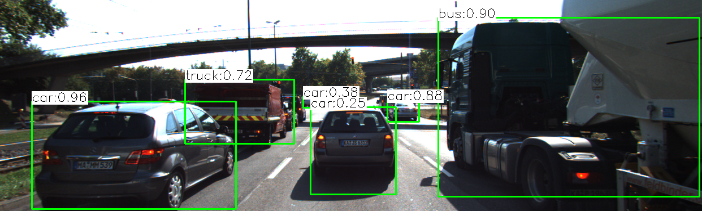
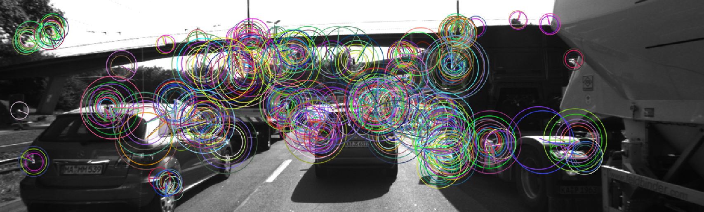
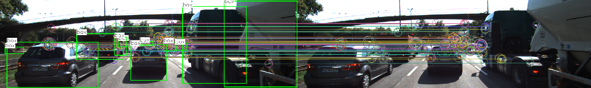
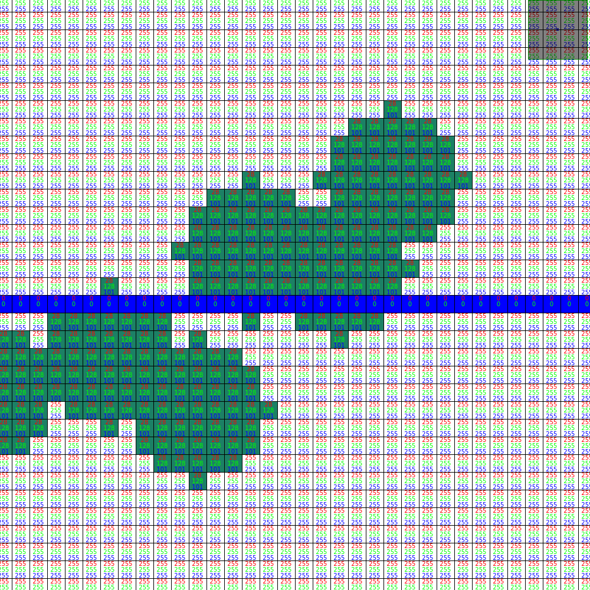
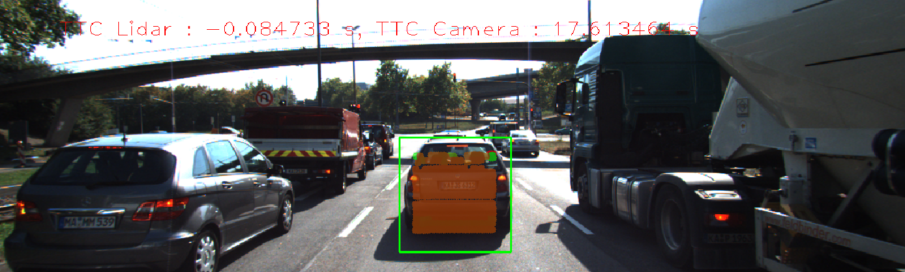
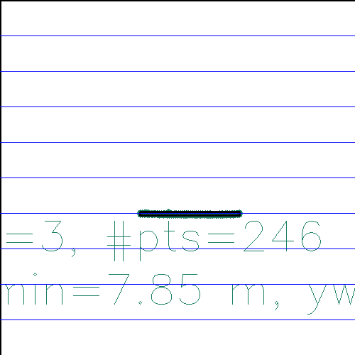
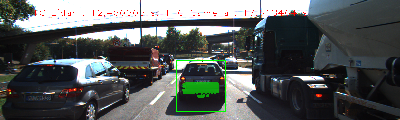

# SFND 3D Object Tracking

Welcome to the final project of the camera course. By completing all the lessons, you now have a solid understanding of keypoint detectors, descriptors, and methods to match them between successive images. Also, you know how to detect objects in an image using the YOLO deep-learning framework. And finally, you know how to associate regions in a camera image with Lidar points in 3D space. Let's take a look at our program schematic to see what we already have accomplished and what's still missing.

In this final project, you will implement the missing parts in the schematic. To do this, you will complete four major tasks: 
1. First, you will develop a way to match 3D objects over time by using keypoint correspondences. 
2. Second, you will compute the TTC based on Lidar measurements. 
3. You will then proceed to do the same using the camera, which requires to first associate keypoint matches to regions of interest and then to compute the TTC based on those matches. 
4. And lastly, you will conduct various tests with the framework. Your goal is to identify the most suitable detector/descriptor combination for TTC estimation and also to search for problems that can lead to faulty measurements by the camera or Lidar sensor. In the last course of this Nanodegree, you will learn about the Kalman filter, which is a great way to combine the two independent TTC measurements into an improved version which is much more reliable than a single sensor alone can be. But before we think about such things, let us focus on your final project in the camera course. 
Rubric
## FP.1 Match 3D Objects
Implement the method "matchBoundingBoxes", which takes as input both the previous and the current data frames and provides as output the ids of the matched regions of interest (i.e. the boxID property). Matches must be the ones with the highest number of keypoint correspondences.
This function is declared in camFusion.hpp as 
void matchBoundingBoxes(std::vector<cv::DMatch> &matches, std::map<int, int> &bbBestMatches, DataFrame &prevFrame, DataFrame &currFrame);
So we need 2 dataframes and a collection of matches, so Yolo and key point and descriptor detection must be performed.

First we perform Yolo detection, then a set of bounding boxes are created and stored in DataFrame structure:

After that, a set of keypoints and descriptors are detected in the images.

And we try to identify each bounding box between images.

So we make this call
map<int, int> bbBestMatches;
matchBoundingBoxes(matches, bbBestMatches, *(dataBuffer.end()-2), *(dataBuffer.end()-1));

## FP.2 Compute Lidar-based TTC
Compute the time-to-collision in second for all matched 3D objects using only Lidar measurements from the matched bounding boxes between current and previous frame.
This function is declared in camFusion.hpp
void computeTTCLidar(std::vector<LidarPoint> &lidarPointsPrev,std::vector<LidarPoint> &lidarPointsCurr, double frameRate, double &TTC); 
So we need the LIDAR data from the previous frame, the LIDAR data from the actual frame and the time between frames, so we can calculate TTC.
We have a lot of LIDAR DATA, but not all the data will be needed.

So we perform a cropping of the data, so only a small subset of point in the area of interest are used.

After that, we can calculate the distance in the X coordinate.
In the first frame, the X will be d0 and in the last frame X will be d1.

We will take all the X points and divide between the number of points. 
After that, we can solve TTC in that equation.(3)

## FP.3 Associate Keypoint Correspondences with Bounding Boxes
Prepare the TTC computation based on camera measurements by associating keypoint correspondences to the bounding boxes which enclose them. All matches which satisfy this condition must be added to a vector in the respective bounding box.

Is called in line 390 of FinalProject_Camera.cpp
Implemented from line 135 to line 161 of camFusion_Student.cpp 
## FP.4 Compute Camera-based TTC
Compute the time-to-collision in second for all matched 3D objects using only keypoint correspondences from the matched bounding boxes between current and previous frame.
Its an slightly different approach from the code in the course.

Is called in line 391 of FinalProject_Camera.cpp
Implemented from line 166 to line 200 of camFusion_Student.cpp 
## FP.5 Performance Evaluation 1
Find examples where the TTC estimate of the Lidar sensor does not seem plausible. Describe your observations and provide a sound argumentation why you think this happened.
To run the performance on all the combinations I have modified the FinalProject_Camera.cpp file.

There are a #define createTableDetectors that when defined, run all posible combinations and log the results in a file.

And the following table give the results for LIDAR

| Det/Desc | 01-02   | 02-03   | 03-04   | 04-05   | 05-06   | 06-07   | 07-08   | 08-09   | 09-10| 10-11| 11-12| 12-13| 13-14| 14-15| 15-16| Deviation| 
| :-------: | :--: | :--: | :--: | :--: | :--: | :--: | :--: | :--: | :--: | :--: | :--: | :--: | :--: | :--: | :--: | 
| LIDAR |12.499 |12.811 |17.633 |14.143 |12.595 |13.585 |13.618 |13.232 |12.459 |12.331 |11.477 |10.212 |9.242 |9.517 |8.410 |8.815 |11.365 |8.425 | - |

It seems that the ego car is braking, so the ttc must be going down, but in frames 03-05 is going up and also in frame 14-15.

I cant find any reason, but it can be because as the front car moves closer we are taking fixed part of the LIDAR scanning, and maybe we are taking account on different protrusions of the car.

## FP.6 Performance Evaluation 2
Run several detector / descriptor combinations and look at the differences in TTC estimation. Find out which methods perform best and also include several examples where camera-based TTC estimation is way off. As with Lidar, describe your observations again and also look into potential reasons.
As told before, after define #define createTableDetectors the program is run and the following table is generated:

| Det/Desc | 01-02   | 02-03   | 03-04   | 04-05   | 05-06   | 06-07   | 07-08   | 08-09   | 09-10| 10-11| 11-12| 12-13| 13-14| 14-15| 15-16| Deviation| 
| :-------: | :--: | :--: | :--: | :--: | :--: | :--: | :--: | :--: | :--: | :--: | :--: | :--: | :--: | :--: | :--: | 
| LIDAR |12.499 |12.811 |17.633 |14.143 |12.595 |13.585 |13.618 |13.232 |12.459 |12.331 |11.477 |10.212 |9.242 |9.517 |8.410 |8.815 |11.365 |8.425 | - |
|HARRIS/BRISK|0.788 |-12.571 |-160.076 |-2.286 |-491.338 |-0.715 |-12.573 |-18.924 |nan |-inf |5.685 |0.681 |73.308 |-1.817 |-9.461 |-8.570 |0.950 |-inf |nan|
|HARRIS/BRIEF|0.788 |7.129 |-41.563 |-2.286 |26.167 |76.011 |23.895 |7.090 |-9.158 |-25.223 |5.685 |0.681 |-11.215 |-3.911 |-30.770 |-1.397 |0.730 |-inf |inf|
|HARRIS/FREAK|1.289 |-2.225 |-32.151 |-15.808 |-16.052 |0.351 |-14.180 |-9.240 |nan |3.109 |5.685 |0.681 |8.609 |2.771 |-33.384 |-8.229 |nan |nan |nan|
|HARRIS/SIFT|0.788 |45.469 |-31.924 |-2.286 |7.597 |-46.026 |3.968 |7.090 |1.482 |-25.223 |-6.731 |0.681 |-1.791 |-0.454 |7.028 |22.570 |0.730 |-inf |inf|
|HARRIS/ORB|0.788 |7.129 |-41.563 |-2.286 |14.384 |5.177 |16.221 |7.090 |nan |-inf |-10.807 |0.681 |-1.791 |-10.666 |-30.770 |-1.592 |0.950 |-inf |nan|
|SHITOMASI/BRISK|17.513 |-inf |-2.481 |-1.869 |2.421 |-inf |-inf |-inf |-0.536 |-inf |-0.986 |0.785 |1.958 |2.876 |0.630 |1.858 |-0.732 |0.029 |inf|
|SHITOMASI/BRIEF|2.785 |2.684 |0.957 |0.629 |0.233 |7.958 |53.949 |-1.161 |1.339 |1.050 |2.608 |4.293 |5.396 |5.162 |6.496 |0.563 |4.523 |-1.387 |103.174302|
|SHITOMASI/FREAK|3.691 |2.261 |-7.873 |-2.170 |1.637 |5.177 |-0.029 |-0.083 |0.864 |1.272 |0.856 |1.008 |2.816 |-inf |1.242 |-0.977 |3.607 |1.368 |inf|
|SHITOMASI/SIFT|21.128 |5.719 |-0.842 |0.398 |2.940 |7.958 |3.593 |6.245 |1.417 |2.084 |1.362 |1.040 |3.750 |9.002 |5.264 |5.977 |4.595 |3.517 |86.831593|
|SHITOMASI/ORB|3.788 |9.219 |-5.219 |0.361 |3.270 |6.145 |5.357 |-2.005 |-1.297 |2.255 |-1.447 |4.293 |2.237 |2.165 |1.089 |2.869 |4.595 |2.654 |60.266471|
|FAST/BRISK|0.085 |1.999 |3.420 |1.059 |32.738 |2.476 |0.039 |-1.270 |0.218 |2.063 |3.279 |2.444 |4.358 |1.724 |2.129 |3.689 |-2.713 |2.886 |68.592119|
|FAST/BRIEF|-2.585 |4.724 |2.739 |1.264 |47.966 |17.632 |3.281 |3.883 |6.484 |7.767 |6.694 |4.781 |6.304 |2.491 |4.851 |9.635 |-0.544 |7.514 |141.139411|
|FAST/FREAK|11.089 |7.688 |-1.625 |6.902 |18.020 |-0.776 |1.710 |-1.491 |-inf |2.531 |4.268 |1.337 |1.188 |0.991 |1.924 |2.862 |-1.514 |2.964 |inf|
|FAST/SIFT|0.623 |4.575 |9.368 |7.973 |37.721 |23.696 |1.748 |2.494 |6.801 |4.615 |7.042 |4.300 |5.255 |6.740 |4.851 |8.498 |0.397 |5.749 |142.445695|
|FAST/ORB|0.562 |5.276 |10.590 |6.463 |33.683 |18.535 |1.492 |1.019 |1.712 |7.934 |-inf |4.313 |8.125 |0.717 |1.350 |3.463 |0.823 |37.194 |inf|
|BRISK/BRISK|1.782 |25.103 |0.555 |1.333 |22.260 |3.928 |1.045 |11.745 |1.695 |2.424 |1.834 |-0.166 |1.614 |3.222 |8.700 |2.357 |-1.732 |3.286 |94.781649|
|BRISK/BRIEF|4.340 |15.371 |2.546 |10.195 |14.967 |42.055 |15.781 |6.911 |12.542 |7.052 |12.725 |9.586 |10.618 |7.251 |3.277 |9.471 |5.593 |11.132 |201.411170|
|BRISK/FREAK|-0.904 |7.895 |-3.948 |-1.432 |12.035 |5.699 |-1.228 |10.432 |6.542 |1.882 |6.749 |3.031 |7.662 |3.232 |11.417 |2.167 |-2.811 |2.395 |91.459344|
|BRISK/SIFT|3.287 |5.858 |2.118 |-0.279 |26.068 |5.042 |0.829 |4.638 |4.320 |3.487 |0.660 |2.382 |7.684 |2.814 |6.851 |3.204 |2.685 |5.851 |88.057511|
|BRISK/ORB|17.643 |4.857 |1.124 |7.430 |9.524 |6.571 |9.410 |3.084 |3.605 |0.809 |4.271 |7.598 |1.738 |4.057 |4.243 |3.002 |3.615 |12.688 |105.267494|
|ORB/BRISK|2.910 |0.974 |14.320 |11.869 |18.350 |-2.537 |36.555 |8.772 |-3.200 |1.364 |-0.638 |8.733 |-13.352 |11.337 |0.467 |20.053 |-0.561 |8.507 |164.499581|
|ORB/BRIEF|10.512 |25.525 |97.333 |1.108 |13.949 |15.688 |26.489 |-15.198 |18.091 |1.342 |3.687 |0.517 |4.087 |1.973 |1.201 |1.092 |1.466 |8.971 |248.229307|
|ORB/FREAK|0.986 |5.327 |41.678 |-3.440 |-14.182 |0.209 |-244.755 |-3.680 |-1.886 |-69.674 |-2.732 |42.137 |-3.767 |28.060 |1.826 |1.252 |1.951 |186.472 |654.014461|
|ORB/SIFT|-8.316 |-9.612 |-2.529 |-165.395 |-12.362 |0.289 |3.729 |1.074 |0.931 |-6.434 |16.430 |47.231 |-1.292 |4.263 |13.821 |3.909 |9.404 |5.272 |312.291744|
|ORB/ORB|7.769 |-422.123 |9.140 |14.954 |43.377 |-17.485 |2534.904 |85.334 |-inf |2.225 |2.748 |1.605 |1.578 |67.801 |3.496 |1.199 |1.923 |9.451 |inf|
|AKAZE/BRISK|3.613 |8.242 |-4.677 |3.722 |5.763 |2.568 |2.096 |0.702 |1.067 |-0.424 |1.041 |5.579 |1.249 |7.999 |11.580 |5.102 |0.529 |0.697 |66.648103|
|AKAZE/BRIEF|6.501 |3.193 |0.788 |0.158 |5.821 |8.167 |8.181 |1.204 |9.471 |-0.672 |5.639 |9.123 |1.017 |7.523 |10.796 |3.253 |-0.060 |3.218 |84.785671|
|AKAZE/FREAK|1.523 |5.048 |0.528 |-0.552 |2.877 |1.611 |1.531 |6.781 |10.088 |-0.703 |1.029 |8.666 |2.243 |0.510 |2.844 |5.315 |-0.420 |0.547 |52.817389|
|AKAZE/SIFT|1.683 |7.706 |-1.032 |2.874 |7.491 |10.797 |2.268 |6.266 |7.061 |0.975 |2.666 |4.240 |5.798 |6.626 |11.421 |1.217 |0.277 |2.870 |83.267798|
|AKAZE/ORB|3.522 |7.939 |-3.806 |4.818 |4.214 |7.527 |7.569 |7.605 |0.784 |-0.703 |5.322 |11.104 |5.192 |4.242 |3.859 |3.672 |0.096 |3.944 |85.919475|
|AKAZE/AKAZE|2.527 |7.693 |-2.596 |0.816 |8.397 |6.307 |2.671 |6.431 |7.259 |3.619 |3.728 |4.241 |2.958 |6.227 |10.008 |4.023 |0.256 |3.304 |83.061582|
|SIFT/BRISK|-2.204 |-0.684 |-5.794 |20.649 |2.485 |-1.982 |0.388 |-0.397 |1.292 |3.672 |0.643 |-0.032 |0.864 |3.388 |3.704 |1.571 |-0.517 |6.134 |56.398569|
|SIFT/BRIEF|-0.557 |0.132 |-1.444 |10.525 |2.502 |-3.422 |3.024 |6.384 |0.444 |-1.244 |2.336 |-0.809 |2.579 |2.653 |2.015 |2.789 |-1.238 |4.702 |48.797628|
|SIFT/FREAK|-2.118 |0.587 |-4.663 |8.316 |2.667 |-1.385 |1.282 |-3.879 |3.284 |-2.632 |2.878 |6.649 |1.352 |0.430 |1.212 |0.270 |-2.174 |1.362 |47.139843|
|SIFT/SIFT|-1.850 |-1.052 |-5.206 |7.050 |0.365 |-2.645 |-0.839 |0.947 |-0.671 |0.875 |-0.758 |1.264 |4.063 |0.795 |1.614 |0.714 |-1.786 |2.052 |34.546511|

As keypoint detector SIFT and AKAZE seems to perform well, because all of them find enough points and give the best results.

In the case of the combination SIFT/SIFT the result is so similarto LIDAR in many frames.

As descriptor SIFT seems to work well except on HARRIS, but HARRIS as keypoint detector doesnt perform well with any descriptor.

With ORB/SIFT there are some frames which time difference of more than 100 seconds. It will be because there wil be less keypoints found.

## Dependencies for Running Locally
* cmake >= 2.8
  * All OSes: [click here for installation instructions](https://cmake.org/install/)
* make >= 4.1 (Linux, Mac), 3.81 (Windows)
  * Linux: make is installed by default on most Linux distros
  * Mac: [install Xcode command line tools to get make](https://developer.apple.com/xcode/features/)
  * Windows: [Click here for installation instructions](http://gnuwin32.sourceforge.net/packages/make.htm)
* OpenCV >= 4.1
  * This must be compiled from source using the `-D OPENCV_ENABLE_NONFREE=ON` cmake flag for testing the SIFT and SURF detectors.
  * The OpenCV 4.1.0 source code can be found [here](https://github.com/opencv/opencv/tree/4.1.0)
* gcc/g++ >= 5.4
  * Linux: gcc / g++ is installed by default on most Linux distros
  * Mac: same deal as make - [install Xcode command line tools](https://developer.apple.com/xcode/features/)
  * Windows: recommend using [MinGW](http://www.mingw.org/)

## Basic Build Instructions

1. Clone this repo.
2. Make a build directory in the top level project directory: `mkdir build && cd build`
3. Compile: `cmake .. && make`
4. Run it: `./3D_object_tracking`.
